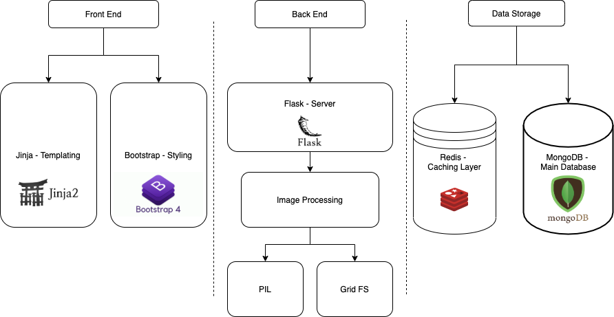
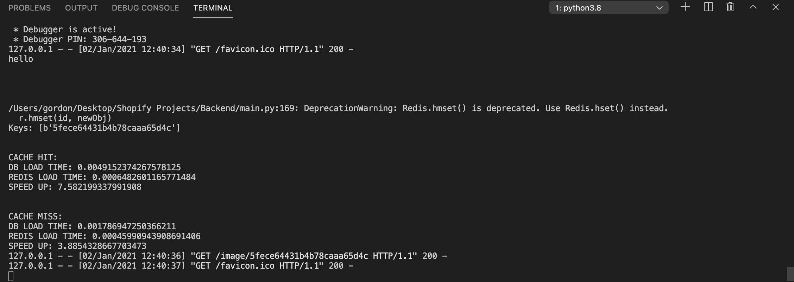

# Image-Repository

### Overview
An image repository application that uses restful routing and other backend engineering principles.

### Project Structure
For this application there are three distinct layers: the frontend which is responsible for rendering the images, the backend which is responsible for server side logic, and data storage used to save and retrieve image data.

### Instructions
At the index route of this application there will be a search bar where the name of the movie you would like to search for, or nominate can be inputed. The input value must be a correctly spelled word and should be at least some part of the desired movie you wish to find. For instance, if I wanted to search for the movie “Toy Story”, inputting “toy”, “story” and “Toy Story” will all display some results of the “Toy Story” franchise, but the more specific the input value, the better the results. Once finished inputting a value, press “return” on the keyboard or search icon so that the list movies closest to your inputted value will be displayed below.

### Redis Caching Layer
I decided to include a Redis caching layer in the backend project because I knew Redis could greatly improve the speed at which images would be retrieved from the backend. 
Retrieval from redis proves to be faster than using the MongoDB database for both cache hits and misses. A cache hit corresponds to when an image (or the image id) is found in the database, and a cache miss is for when the image is not found.

In the image below I indicate the timing analysis used to compare the cache hit and cache miss speeds of redis when compared to mongodb.

As shown here where each retrieval of data was timed, Redis proves to be 3.9 times (or 290%) faster when the image is not in Redis or MongoDB, and 7.6 times (or 660%) faster when images are present within both Redis and MongoDB.
I chose to use Redis for the retrieval of a single image because I realized that adding this caching logic to the index route would be the same as retrieving all the images from MongoDB and storing them all into Redis as well. This is an infeasible step to take as when the image repository gets too large, the cache will not be efficiently utilized.
Therefore, the only route Redis is utilized in is the id specific route for an image, and this is because I realized that the images that are sent to the id specific route could be faster retrieved from Redis since it may be an image that is frequently clicked on.

### Testing
For testing I used an application called Postman to make sure that each route responded correctly.

### Improvements
Creating authentication that ties the frontend to the backend could make this application better by allowing only those with proper access to an image the ability to delete them. This could have been achieved with Firebase Authentication. Another improvement to the frontend I would have made would be utilizing React. This is because react is a nice framework that organizes the frontend. I would use Axios to connect React and my Flask server.

